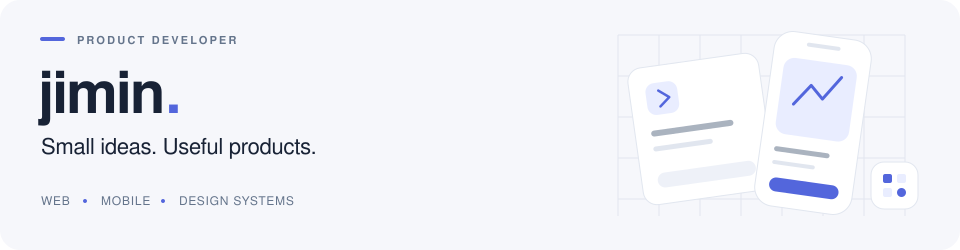
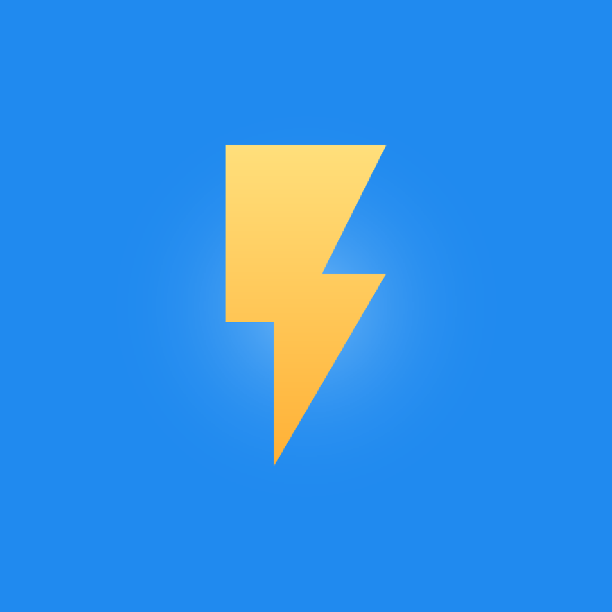
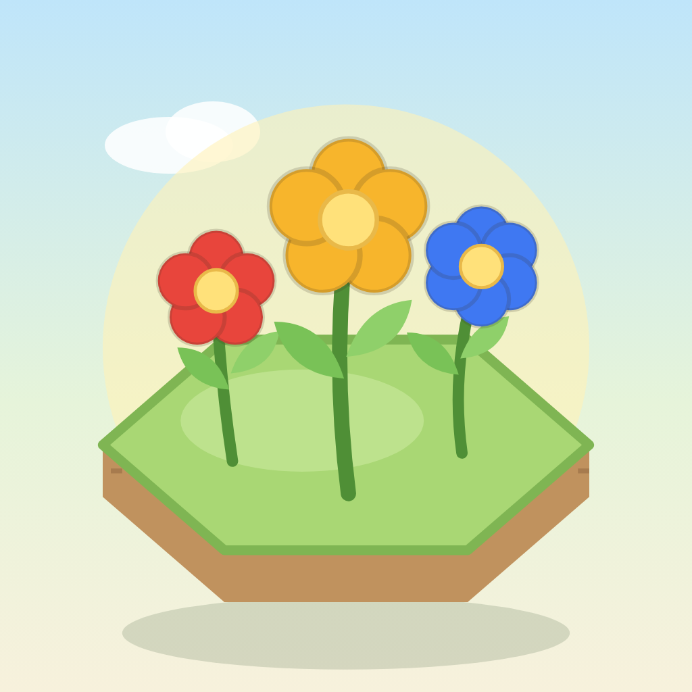
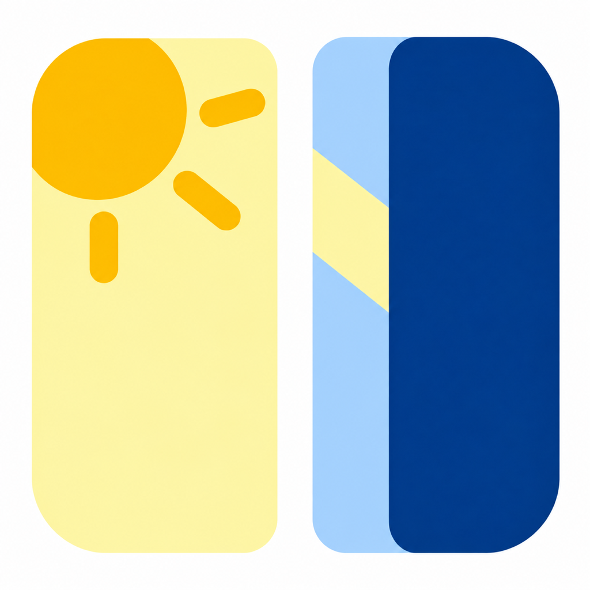
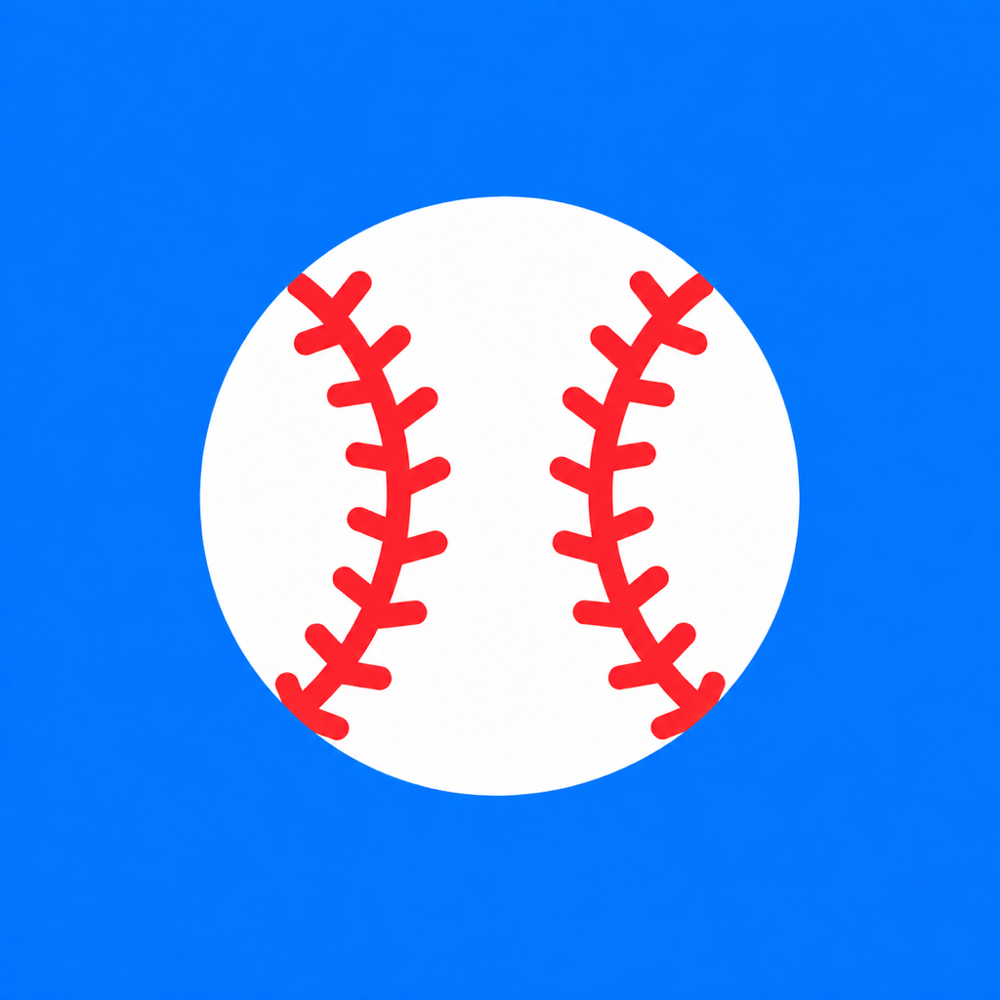
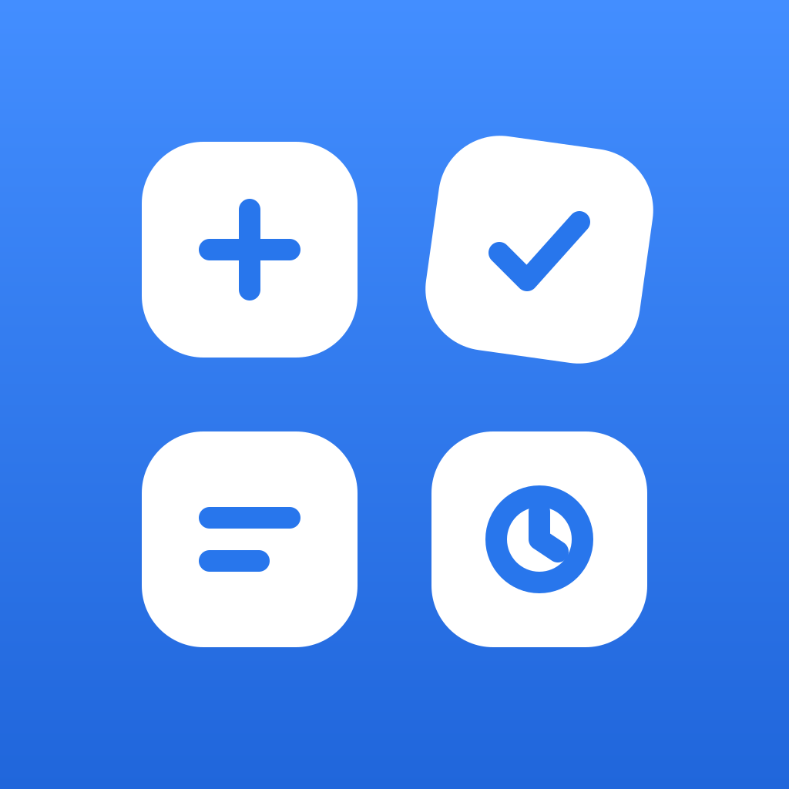
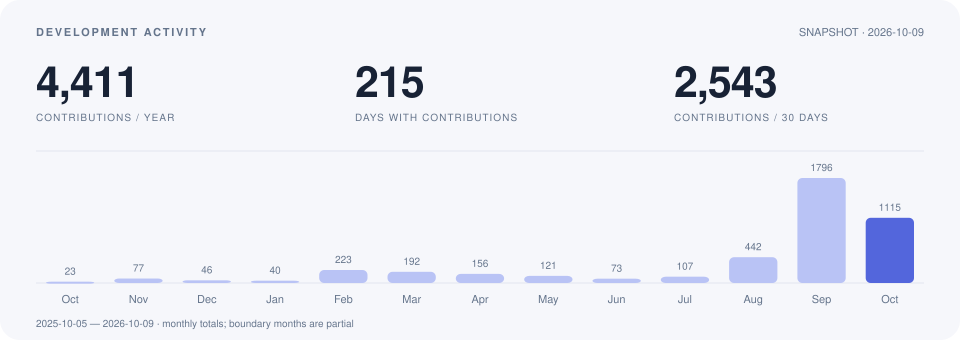

<picture>
  <source media="(prefers-color-scheme: dark)" srcset="./assets/header-dark.svg">
  <source media="(prefers-color-scheme: light)" srcset="./assets/header-light.svg">
  
</picture>

웹과 모바일에서 쓸 수 있는 작은 제품을 만드는 **황지민**입니다.  
아이디어와 화면 설계부터 앱·서버·공용 디자인 시스템까지 직접 다듬습니다.

**[Portfolio ↗](https://jim1286.github.io/)** &nbsp; · &nbsp; **[Storybook ↗](https://jim1286.github.io/hjm-design-system/)** &nbsp; · &nbsp; [Products](#user-content-selected-products) &nbsp; · &nbsp; [Activity](#user-content-development-activity)

### Shared foundations

**[HJM Design System](https://github.com/jim1286/hjm-design-system)**  
React와 React Native가 디자인 토큰, 컴포넌트와 상호작용 계약을 공유합니다.  
제품마다 다른 브랜드를 유지하면서, 반복되는 화면과 동작을 함께 개선합니다.

### Selected products

<!-- Launcher assets follow each app's current configuration; public services
     replace repository links that visitors cannot open. -->
<table>
<tr>
<td width="50%" valign="top">
 
<strong>번뚝 · BurnTok</strong> 
작은 앱을 만들고, 사용하고, 리믹스하는 창작 공간.  
<a href="https://burntok.jmstudioapps.com/">Web ↗</a> · <a href="https://apps.apple.com/kr/app/id6810606625">iOS ↗</a>
</td>
<td width="50%" valign="top">
 
<strong>Diairy</strong> 
동물이 편지를 물고 세계 지도를 건너 전하는 편지 앱.  
<a href="https://airy.jmstudioapps.com/">Web ↗</a> · <a href="https://apps.apple.com/kr/app/id6810897107">iOS ↗</a> · <a href="https://play.google.com/store/apps/details?id=com.jimin.diairy">Android ↗</a>
</td>
</tr>
<tr>
<td valign="top">
 
<strong>Spint</strong> 
지금 서 있는 장소에 작은 꽃을 남기고 세계의 꽃을 둘러보는 앱.  
<a href="https://apps.apple.com/kr/app/id6816477162">iOS ↗</a>
</td>
<td valign="top">
 
<strong>비행중 · Unairplane</strong> 
비행기 모드에서도 예정 일정으로 비행 진행 상황을 추정하는 앱.  
<a href="https://apps.apple.com/kr/app/id6806942992">iOS ↗</a> · <a href="https://play.google.com/store/apps/details?id=com.hjm.unairplane">Android ↗</a>
</td>
</tr>
<tr>
<td valign="top">
 
<strong>선택의창 · Choose Window</strong> 
이동 방향과 태양 위치로 햇빛을 덜 받는 좌석을 추천.  
<a href="https://apps.apple.com/kr/app/id6759096524">iOS ↗</a> · <a href="https://play.google.com/store/apps/details?id=dev.hjm.choosewindow">Android ↗</a>
</td>
<td valign="top">
 
<strong>야잘알 · Yajalal</strong> 
KBO 경기 일정, 선수 기록과 AI 분석을 한곳에서.  
<a href="https://apps.apple.com/kr/app/id6749580205">iOS ↗</a> · <a href="https://play.google.com/store/apps/details?id=dev.hjm.yajalal">Android ↗</a>
</td>
</tr>
</table>

**Utilverse · In progress**  
생활 도구와 도구별 커뮤니티를 모으는 앱을 개발하고 있습니다.

### Development activity

<picture>
  <source media="(prefers-color-scheme: dark)" srcset="./assets/activity-dark.svg">
  <source media="(prefers-color-scheme: light)" srcset="./assets/activity-light.svg">
  
</picture>

GitHub 기여 데이터 · 2026-10-09 스냅샷. 아래 기본 Contribution graph는 GitHub가 계속 갱신합니다.

**Recent public work**

- **Design system** — [사용 지침·화면 API·Web/Native 동작 정리](https://github.com/jim1286/hjm-design-system/pull/53)
- **UI quality** — [실제 제품 도입에서 발견한 공용 컴포넌트 개선](https://github.com/jim1286/hjm-design-system/pull/54)
- **Portfolio** — [공통 UI 도입과 제품·작업 방식 소개](https://github.com/jim1286/jim1286.github.io/pull/26)

### Working stack

`TypeScript` &nbsp; `React / Next.js` &nbsp; `React Native / Expo`  
`Flutter / Dart` &nbsp; `NestJS` &nbsp; `PostgreSQL`

---

작은 아이디어를, 계속 쓰고 싶은 제품으로.
